[Video Preview at youtube](https://www.youtube.com/watch?v=xUIwzkTh7Ho)

# Features
- In a particular project user can add, edit, delete to-do, sub to-do, bug and also can flag them as done or fixed by
respective writer.
- Discussion in a project.
- Project details such as name, short description, deadline, type such as web, mobile.
- Project can be marked as done and also can be deleted by respective user(who create this project).
- Add, remove member in a project, assign todo to a junior member.
- User profile collection of profile image, skills, social media links, email, username, bio etc.
- Image upload for profile pic using Cloudinary.
- User and project dashboard.
- Can track multiple project’s progress.

## Screenshots
### Project 
#### Project Overview

  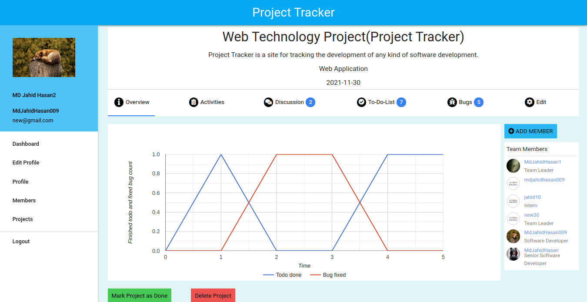

#### Project Activities

  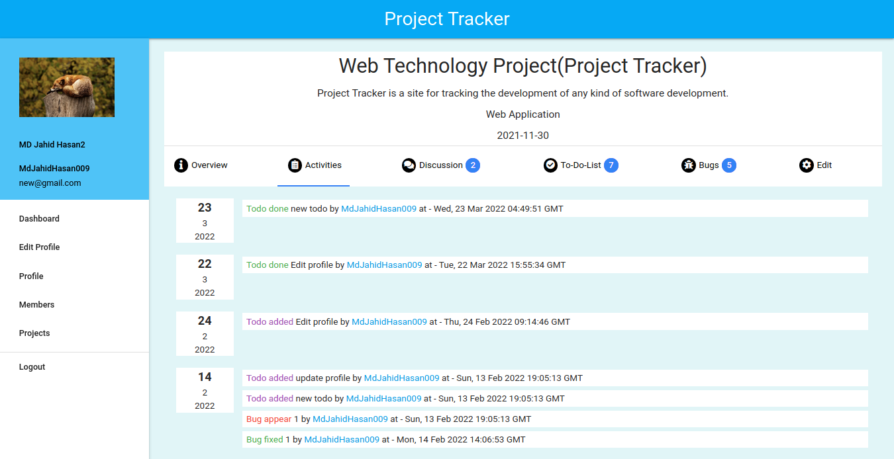

#### Project Discussions

  

#### Project Discussions & Edit

  

#### Project Todo SubTodo InComplete & Completed

  

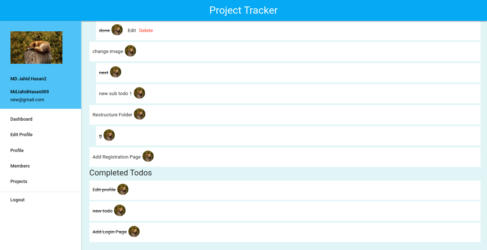

#### Project Todo/SubTodo Add & Edit

  

#### Project Bug Not Fixed & Fixed

  

#### Project Bug Add & Edit

  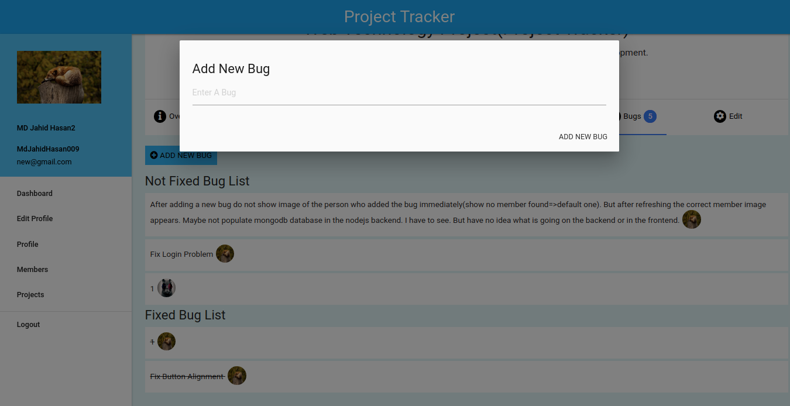

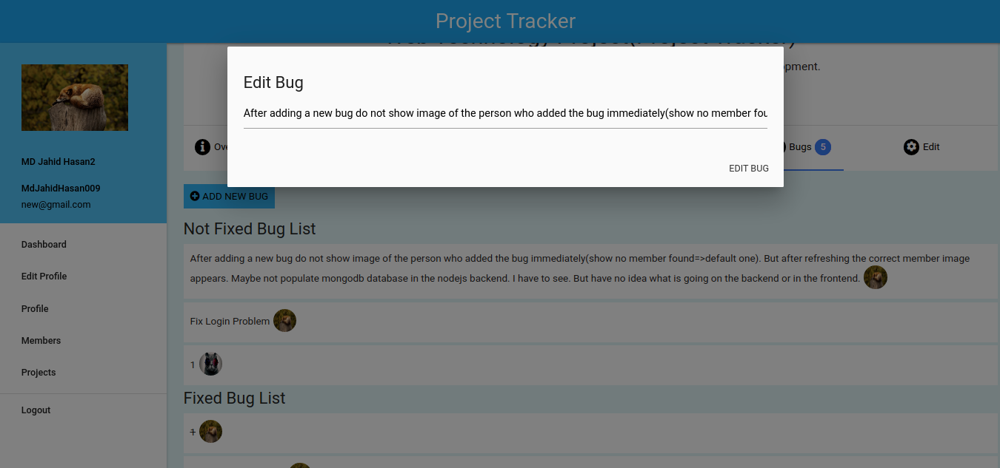

#### Project Details Edit

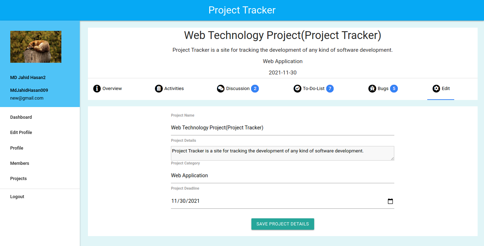

#### Project List

#### User Dashboard

  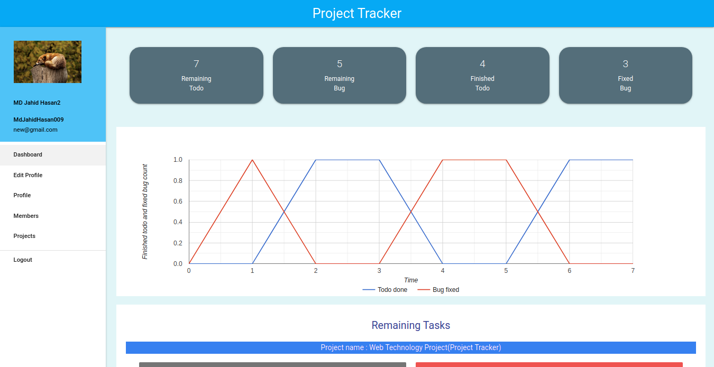

  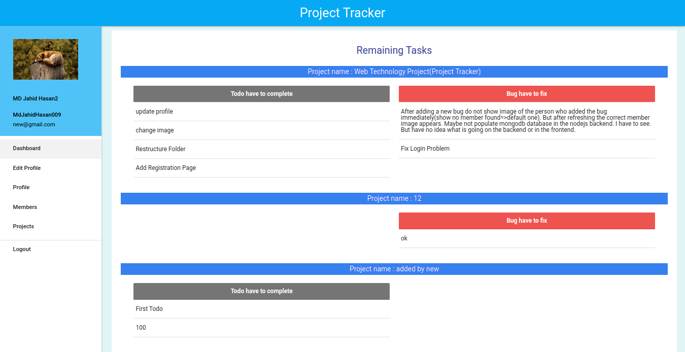

  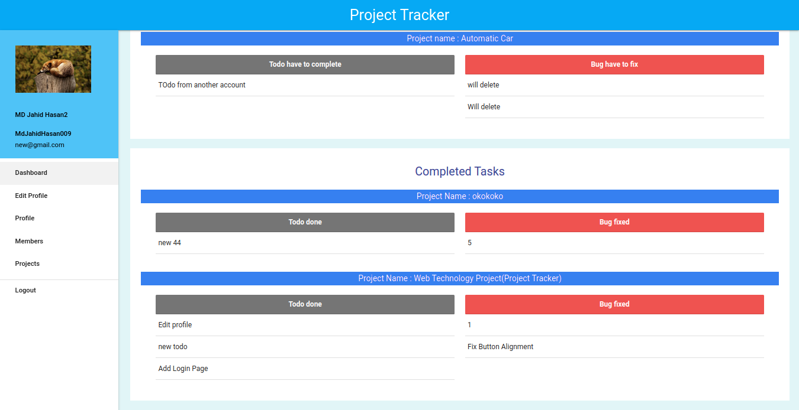

#### Edit User Profile

  

  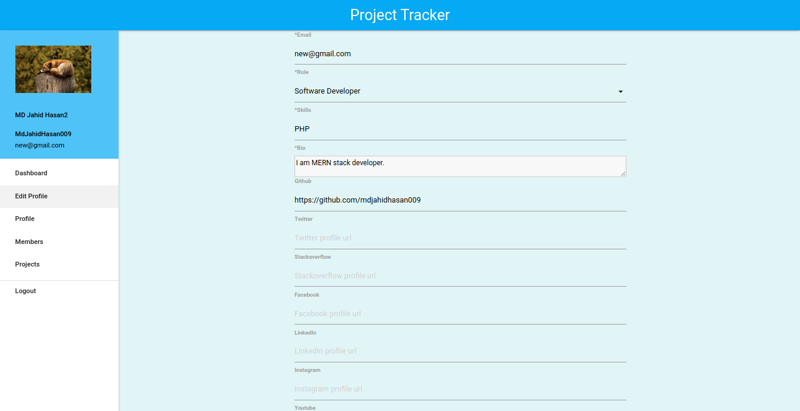

  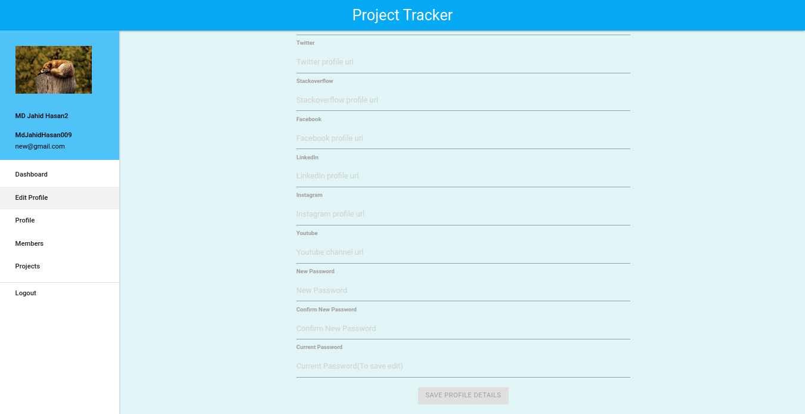

#### User Profile

  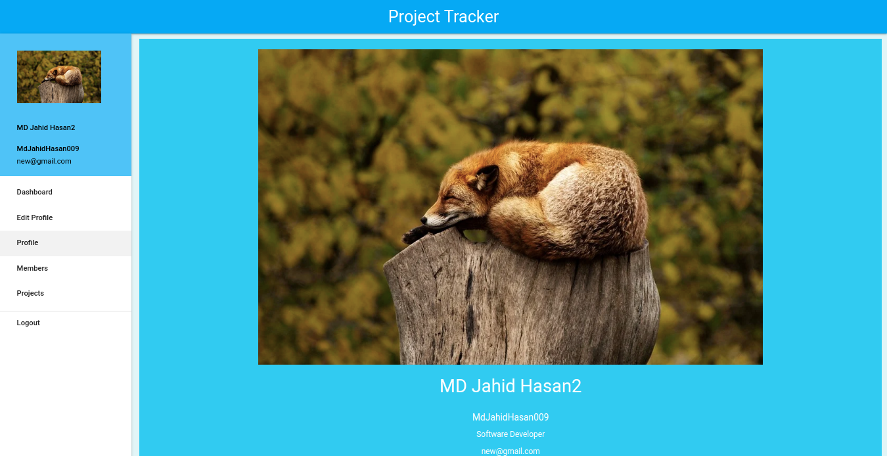

  

#### Members List

  

#### Sign In, Sign Up

  

  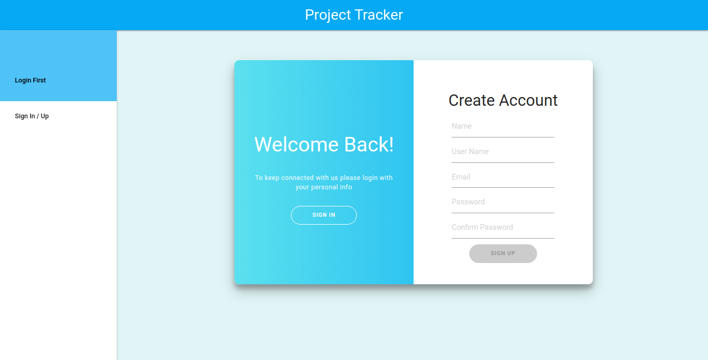

