[Video Preview at youtube](https://www.youtube.com/watch?v=xUIwzkTh7Ho)

### 🌟 Description 🌟
I'm thrilled to share my recent collaboration on the Project Management tool, a comprehensive solution that empowers teams to streamline their workflows and enhance productivity. I was the front-end developer in this project, utilizing Tailwind CSS to create a responsive and user-friendly design.

 

### 🛠️ Key Features 🛠️
- ✅ Task Management: Seamlessly add, edit, delete, and mark tasks as done or fixed.
- ✅ Discussion Boards: Foster collaboration through project-wide discussions.
- ✅ Project Details: Easily manage project information like name, description, deadline, and type.
- ✅ Project Progress: Monitor multiple projects and mark them as completed.
- ✅ Member Management: Add or remove team members and assign tasks efficiently.
- ✅ User Profiles: Create and personalize user profiles with skills, bio, and social media links.
- ✅ Image Upload: Utilize Cloudinary for profile picture uploads.

 

#### 📊 Dashboard Insights 📊
Our project offers robust dashboards for users and projects, providing an at-a-glance view of tasks, sub-tasks, bugs, discussions, and user roles.

 

### 🌐 Flexible Role Management 🌐
Effortlessly manage user roles and permissions within each project, ensuring a smooth collaborative experience.

 

### 👥 Why It Matters 👥
Project Management simplifies complex workflows, promotes collaboration, and enhances productivity, making it an essential tool for teams and businesses alike.

## Screenshots
### Project 
#### Project Overview

  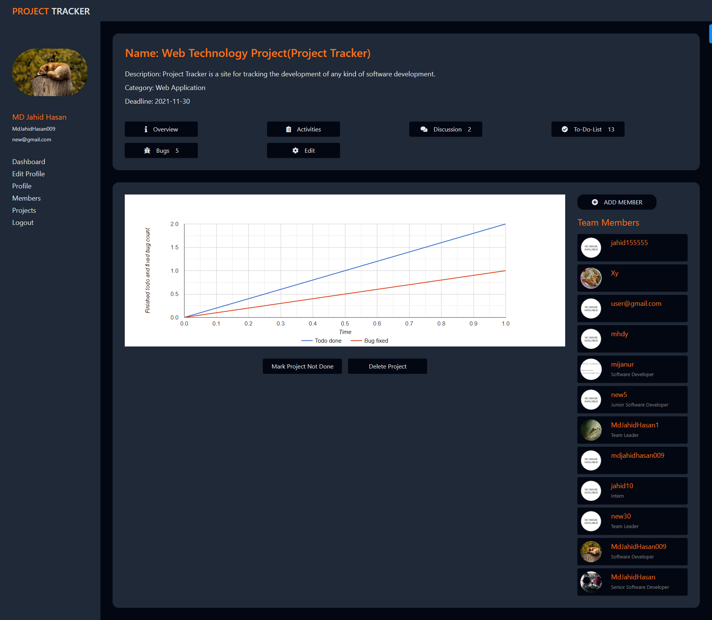

#### Project Activities

  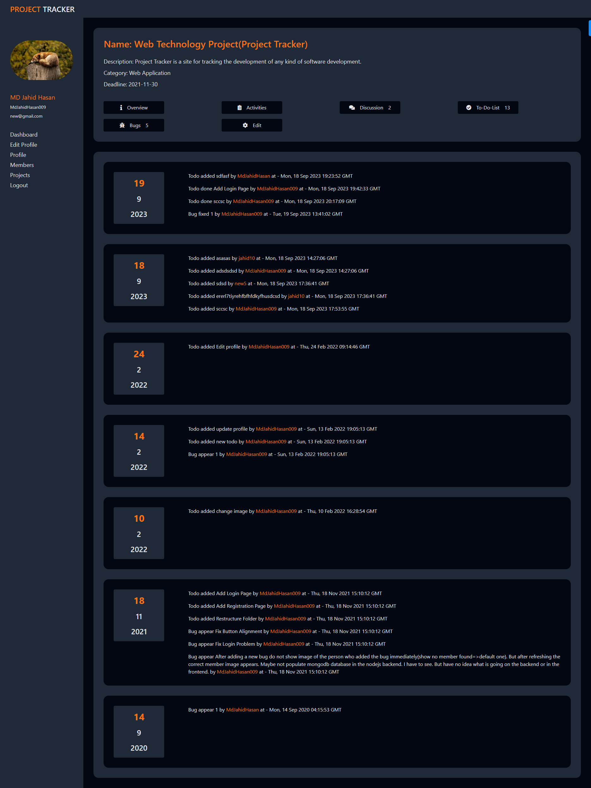

#### Project Discussions

  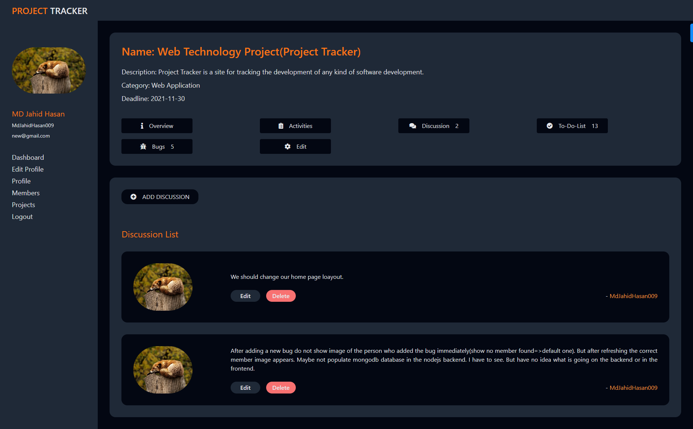

#### Project Discussions & Edit

  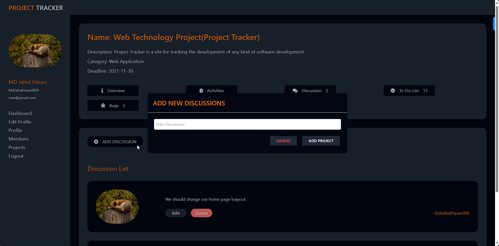

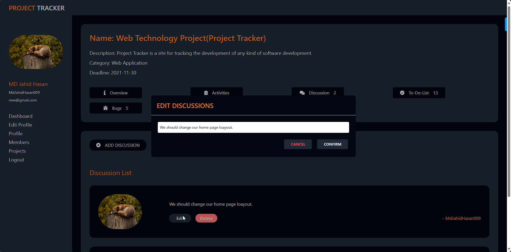

#### Project Todo SubTodo InComplete & Completed

  

#### Project Todo/SubTodo Add & Edit

  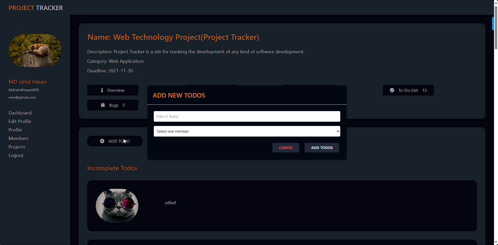

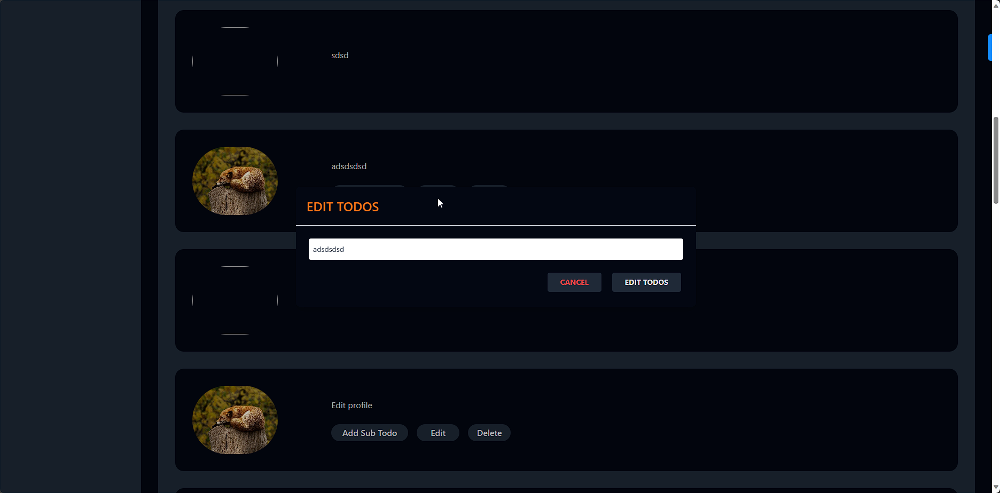

#### Project Bug Not Fixed & Fixed

  

#### Project Bug Add & Edit

  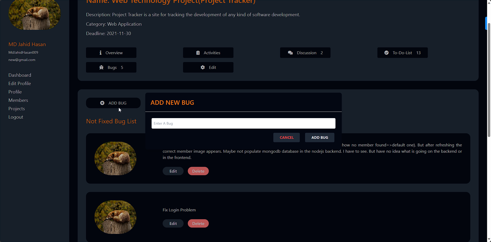

#### Project Details Edit

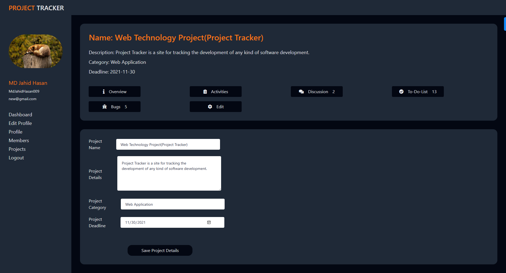

#### Project List

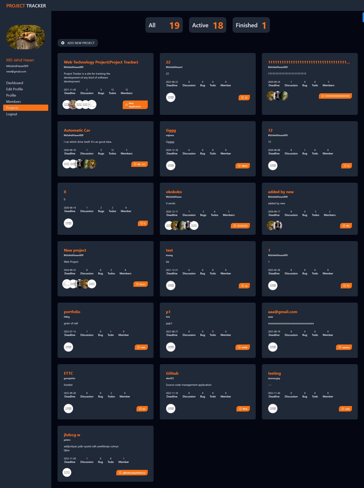

#### User Dashboard

  

  

  

#### Edit User Profile

  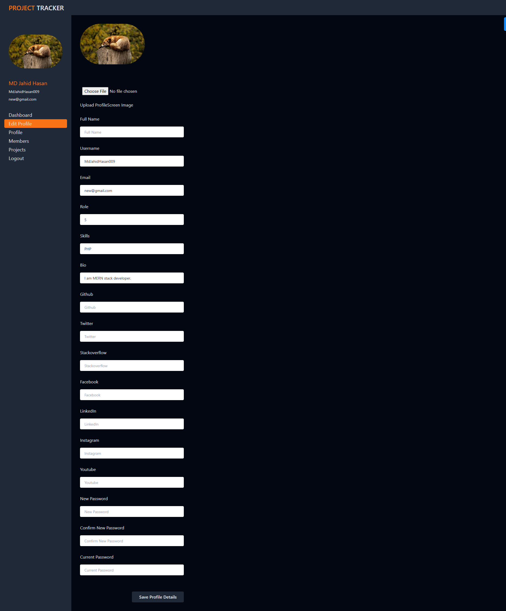

  

  

#### User Profile

  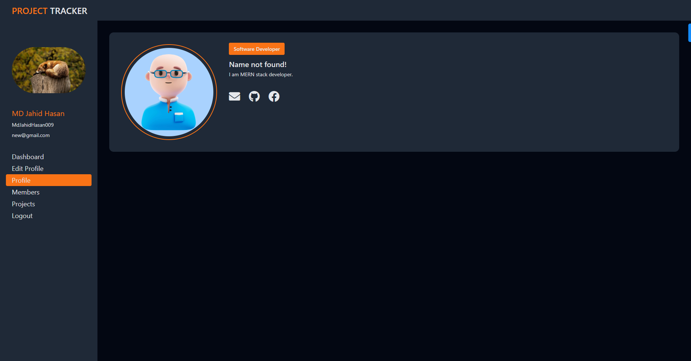

  

#### Members List

  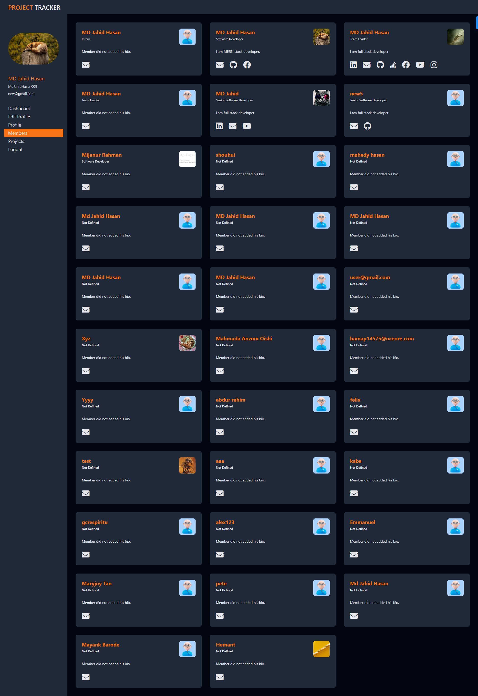

#### Login In

  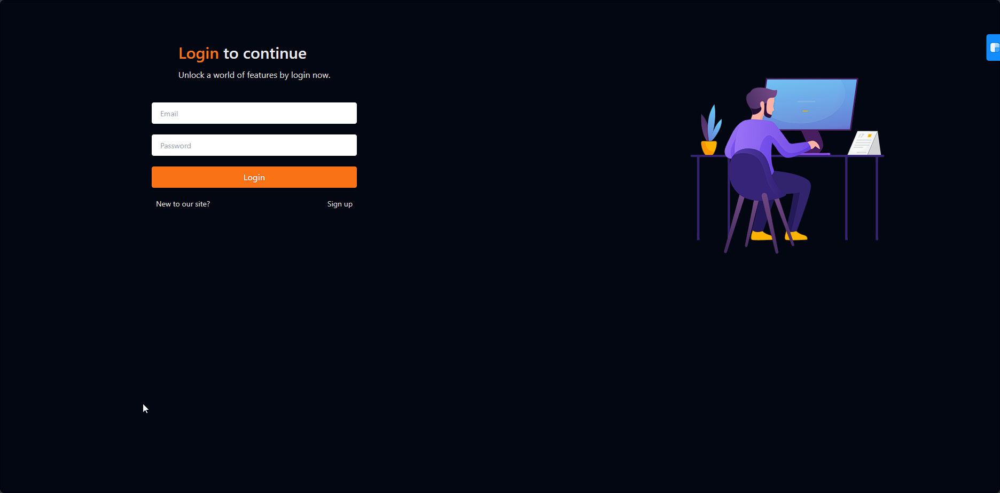

#### Get Started

  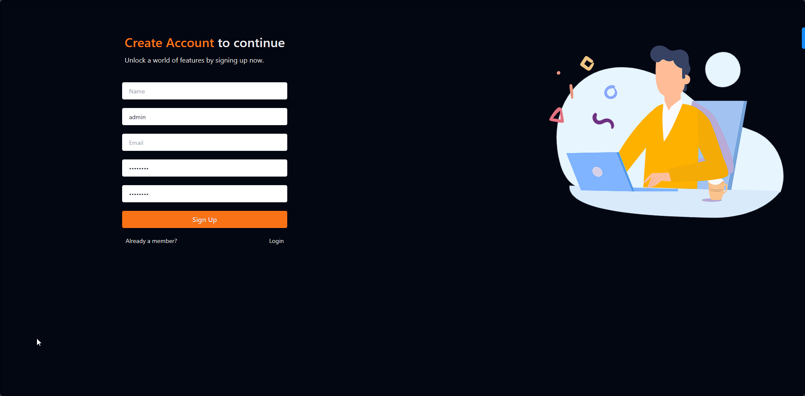

#### Home

  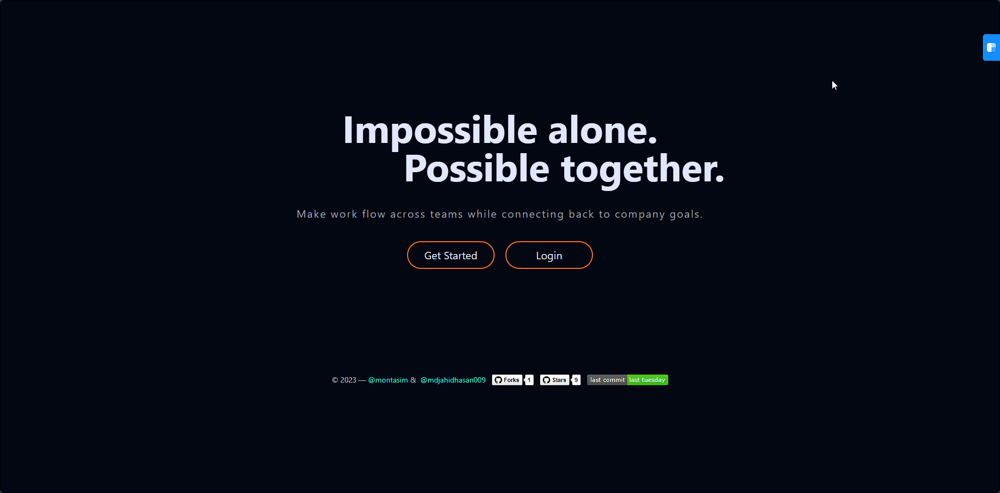

